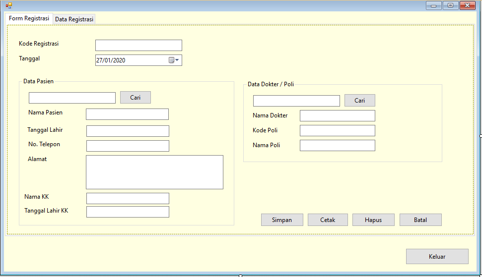
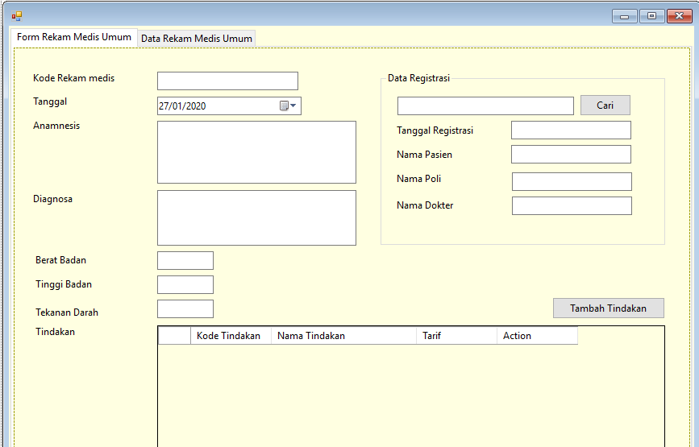
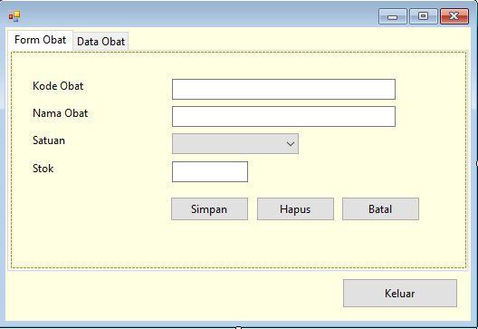
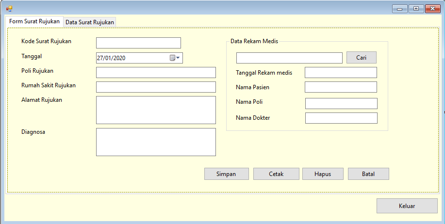

# Aplikasi PUSKESMAS Sederhana

Aplikasi <b>PUSKESMAS</b> sederhana berbasis desktop, dibuat mengunakan <b>VISUAL STUDIO 2010</b> dengan bahasa pemrograman <b>VB.NET</b> dan database SQL SERVER 2008.

</img>
</img> 

</img>
</img>

## Fitur
#### Login
#### Menu Utama
#### Data Master
- Form Data User
- Form Data Pasien
- Form Data Obat
- Form Data Poli
- Form Data Dokter
- Form Data Tindakan
- Form Data Kepala Keluarga
#### Transaksi
- Form Registrasi
- Form Rekamedis Umum
- Form Rekamedis Bumil
- Form Surat Rujukan
- Form Surat Sakit
- Form Surat Sehat
- Form Resep
- Form Tebus Resep
- Form Pembayaran
#### LAPORAN
- Laporan Kunjungan
- Laporan Expired Obat
- Laporan Pasien
- Laporan Pendapatan
- Laporan Resep
- Laporan Setoran
#### SETTING CHANGE PASSWORD
